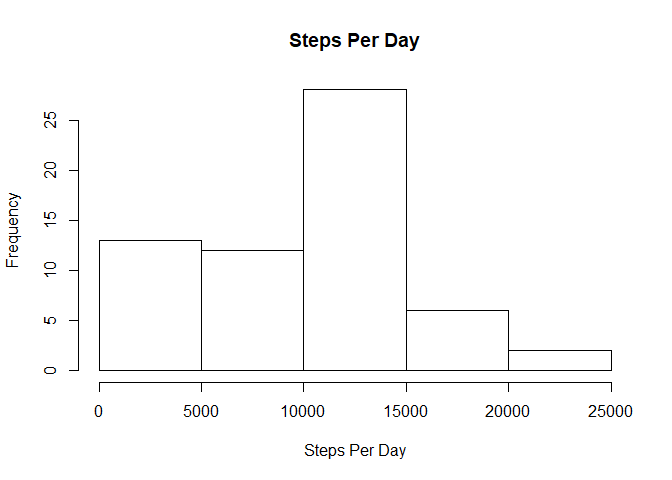
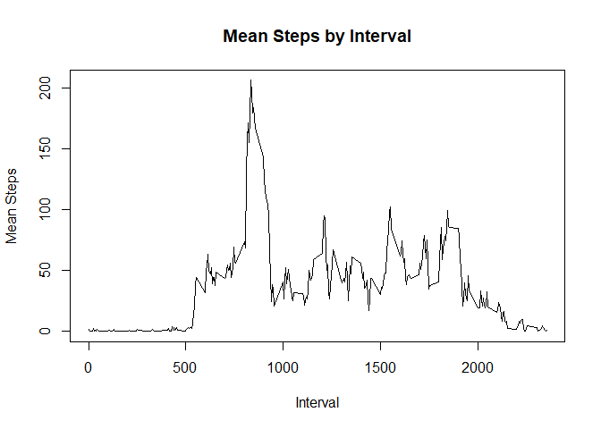
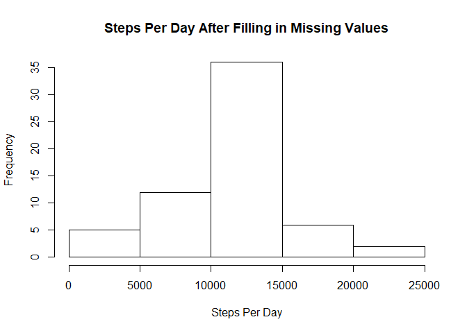

## Loading and preprocessing the data

```r
library(lubridate)
```

```
## Warning: package 'lubridate' was built under R version 3.5.2
```

```
## 
## Attaching package: 'lubridate'
```

```
## The following object is masked from 'package:base':
## 
##     date
```

```r
library(dplyr)
```

```
## 
## Attaching package: 'dplyr'
```

```
## The following objects are masked from 'package:lubridate':
## 
##     intersect, setdiff, union
```

```
## The following objects are masked from 'package:stats':
## 
##     filter, lag
```

```
## The following objects are masked from 'package:base':
## 
##     intersect, setdiff, setequal, union
```

```r
library(lattice)
```

Read the CSV file. Group the resulting data frame by date, and find total number of
steps by day, ignoring missing values. Disply a histogram of steps per day.  


```r
act <- read.csv("activity.csv")
by_day <- act %>% group_by(date) %>% summarize(total_steps = sum(steps, na.rm=T))
hist(by_day$total_steps, main="Steps Per Day", xlab="Steps Per Day")
```

<!-- -->

 
## What is mean total number of steps taken per day?  
Calculate and report the mean total number of steps per day, and the median.


```r
mean_total <- format(mean(by_day$total_steps), digits=9, trim=F)
median_total <- format(median(by_day$total_steps), digits=9, trim=F)
writeLines(paste0("Mean total number of steps taken per day is  : ", mean_total, "\n",
            "Median total number of steps taken per day is: ", median_total))
```

```
## Mean total number of steps taken per day is  : 9354.22951
## Median total number of steps taken per day is: 10395
```


## What is the average daily activity pattern?  
Group data frame by interval, and find mean number of steps for each interval, ignoring missing values. Store the result in the by_int data frame. Plot mean steps against interval.  


```r
by_int <- act %>% group_by(interval) %>% summarize(mean_steps = mean(steps, na.rm=T))
plot(by_int$interval, y=by_int$mean_steps, type='l', main="Mean Steps by Interval", xlab="Interval", ylab="Mean Steps")
```

<!-- -->
  
Find and report the 5-minute interval with the highest mean number of steps.

```r
mint <- by_int$interval[which.max(by_int$mean_steps)]
print(paste0("The 5-minute interval with the highest mean number of steps is: ", mint))
```

```
## [1] "The 5-minute interval with the highest mean number of steps is: 835"
```
  

## Imputing missing values
  
Find and print the number of missing values in the data.

```r
print(paste0("The number of NAs in data is: ", sum(is.na(act))))
```

```
## [1] "The number of NAs in data is: 2304"
```
  
    
Create a new data frame by joining the original with by_int on interval. Replace each missing steps value with the mean number of steps for the interval. Group the result by date and find the total number of steps for each group. Draw a histogram of the total number of steps per day.  
  

```r
newact <- inner_join(act, by_int, by="interval")
newact$steps[is.na(newact$steps)] = newact$mean_steps[is.na(newact$steps)]
newact <- newact[c('steps','date','interval')]
by_day <- newact %>% group_by(date) %>% summarize(total_steps = sum(steps))
hist(by_day$total_steps, main="Steps Per Day After Filling in Missing Values", xlab="Steps Per Day")
```

<!-- -->
  
Calculate and report the mean and median number of steps taken per day.


```r
mean_total <- format(mean(by_day$total_steps), digits=9, trim=F)
median_total <- format(median(by_day$total_steps), digits=9, trim=F)
writeLines(paste0("Mean total number of steps taken per day is  : ", mean_total, "\n",
            "Median total number of steps taken per day is: ", median_total))
```

```
## Mean total number of steps taken per day is  : 10766.1887
## Median total number of steps taken per day is: 10766.1887
```

## Are there differences in activity patterns between weekdays and weekends?
  
In the data frame that had the missing values replaced, create a new factor column called datetype. Its value is 'weekday' for week days and 'weekend' for weekend days. Then group the data frame by datetype and interval, and find mean number of steps for each group.  
  

```r
newact$datetype = factor(sapply( weekdays( ymd(newact$date) ), 
                           function(d) ifelse( (d == 'Sunday' | d == 'Saturday'), 'weekend', 'weekday') ), 
                         levels=c('weekday','weekend') )

forfig <- newact %>% group_by(datetype, interval) %>% summarize(mean_steps = mean(steps))
```

Produce an xyplot of mean number of steps against interval with datetype as the conditioning variable.  
  

```r
xyplot(mean_steps ~ interval | datetype, data=forfig, layout=c(1,2),
       type="l", xlab="Interval", ylab="Number of steps")  
```

<!-- -->
